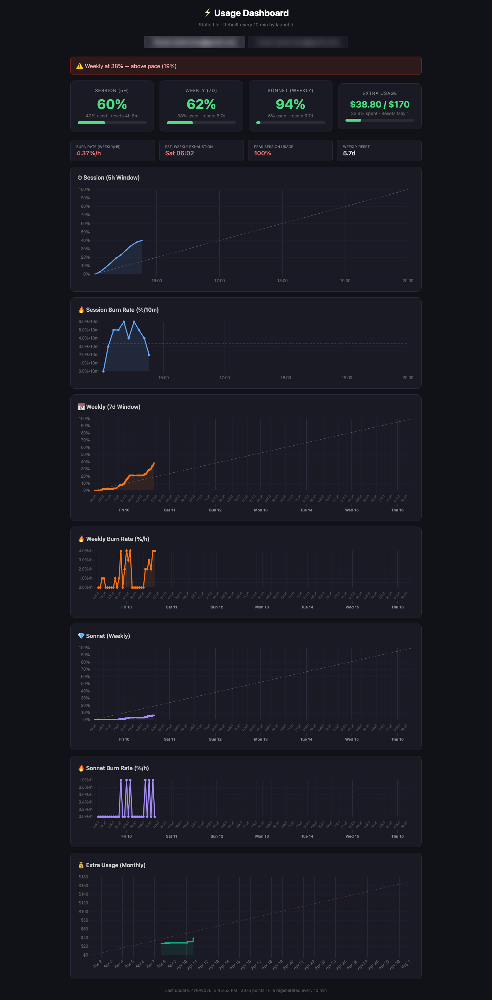

# Claude Usage Dashboard

Self-hosted monitoring dashboard for Claude API rate-limit consumption. Tracks 5-hour session, 7-day weekly, and Sonnet usage windows with burn rate analysis.



## How It Works

A launchd job runs every 5 minutes:
1. **Fetches** usage data from the Claude OAuth API (`/api/oauth/usage`)
2. **Appends** a timestamped record to a JSONL log file
3. **Builds** a static HTML dashboard by injecting the data into `template.html`

The generated `index.html` is fully self-contained — no server needed, just open it in a browser.

## Dashboard Features

- **Usage cards** — remaining % for session (5h), weekly (7d), and Sonnet windows with color-coded alerts
- **Usage plots** — each window scoped to its actual time boundaries with a linear pace reference line
- **Burn rate plots** — instantaneous consumption rate (%/h) per window, with gap detection to filter sleep/downtime artifacts
- **Stats** — burn rate, estimated exhaustion time, peak session usage, weekly reset countdown
- **Alerts** — warning at 50% weekly, critical at 80%

### Usage Plots

| Session (5h) | Weekly (7d) | Sonnet |
|:---:|:---:|:---:|
|  |  |  |

### Burn Rate Plots

| Session | Weekly | Sonnet |
|:---:|:---:|:---:|
|  |  |  |

## Files

| File | Purpose |
|------|---------|
| `template.html` | Source of truth — edit this |
| `index.html` | Generated artifact (gitignored) |
| `serve.py` | Optional dev server on port 8766 |

## Scripts

All pipeline components are in `scripts/`:

| File | Purpose |
|------|---------|
| `scripts/claude-usage-log` | Fetches API data, appends to JSONL, triggers build |
| `scripts/claude-usage-build` | Reads JSONL + template, writes index.html, rotates data (7d retention) |
| `scripts/com.claude-usage.log.plist` | macOS LaunchAgent — runs collector every 5 min |

### Install

```bash
# Symlink scripts into PATH
ln -sf "$(pwd)/scripts/claude-usage-log" ~/.local/bin/claude-usage-log
ln -sf "$(pwd)/scripts/claude-usage-build" ~/.local/bin/claude-usage-build

# Install LaunchAgent (replaces __HOME__ placeholder with your home dir)
sed "s|__HOME__|$HOME|g" scripts/com.claude-usage.log.plist > ~/Library/LaunchAgents/com.claude-usage.log.plist
launchctl load ~/Library/LaunchAgents/com.claude-usage.log.plist
```

## Usage

**View the dashboard:**
```bash
open index.html
# or
python3 serve.py  # http://localhost:8766
```

**Rebuild after editing template:**
```bash
claude-usage-build
```

**Check current usage from CLI:**
```bash
TOKEN=$(security find-generic-password -s "Claude Code-credentials" -w | python3 -c "import sys,json; print(json.load(sys.stdin)['claudeAiOauth']['accessToken'])")
curl -s -H "Authorization: Bearer $TOKEN" -H "anthropic-beta: oauth-2025-04-20" "https://api.anthropic.com/api/oauth/usage" | python3 -m json.tool
```

## Data Format

Each JSONL record:
```json
{
  "ts": "2026-04-04T16:47:27Z",
  "five_hour": 3.0,
  "five_hour_resets": "2026-04-04T20:00:00Z",
  "seven_day": 13.0,
  "seven_day_resets": "2026-04-09T05:00:00Z",
  "sonnet": 0.0,
  "opus": null,
  "extra_enabled": true
}
```
